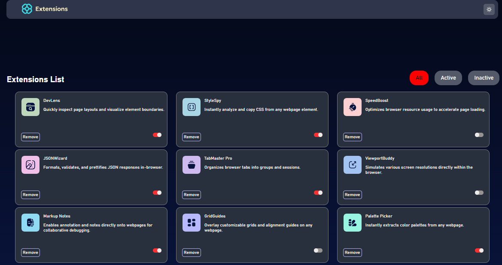

# Frontend Mentor - Browser extensions manager UI solution

This is a solution to the Browser extensions manager UI challenge on Frontend Mentor(https://www.frontendmentor.io/challenges/browser-extension-manager-ui-yNZnOfsMAp). Frontend Mentor challenges help you improve your coding skills by building realistic projects. 

## Table of contents

- overview
  - the-challenge
  - screenshot
  - Mmy-process
  - built-with
  - what-i-learned
  - continued-development
- Author


## Overview

### The challenge

Users should be able to:

- Toggle extensions between active and inactive states
- Filter active and inactive extensions
- Remove extensions from the list
- Select their color theme
- View the optimal layout for the interface depending on their device's screen size
- See hover and focus states for all interactive elements on the page

### Screenshot




## My process

### Built with

- Semantic HTML5 markup
- CSS custom properties
- Flexbox
- CSS Grid
- Mobile-first workflow


### What I learned


```css
.proud-of-this-css {
  flexbox
}
```

### Continued development
I believe am improving and with time i will become perfect in this part giving me trouble asynchronous javascript; 


## Author

- Website - Akunna Victory
- Frontend Mentor - Victory
- Twitter - Aviciinvestment1

